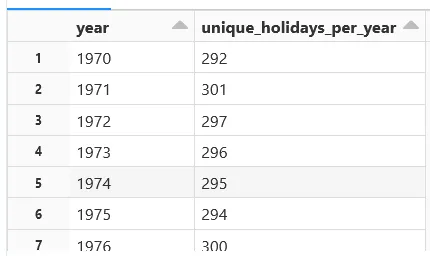
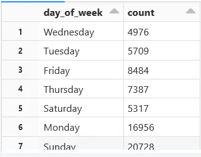
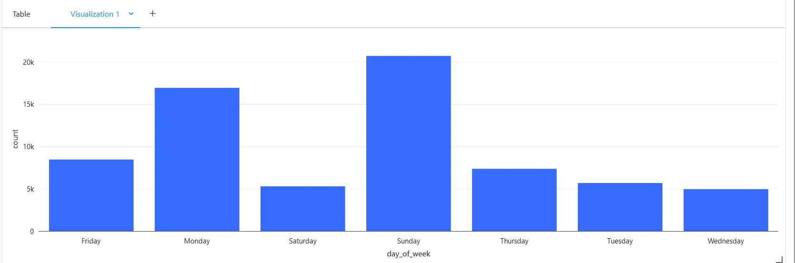
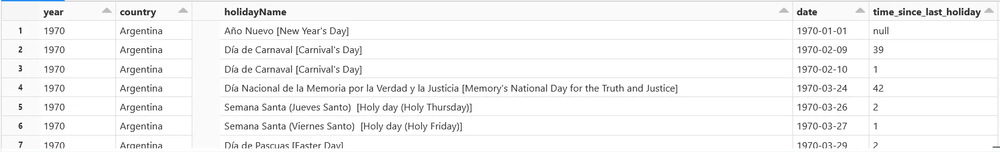
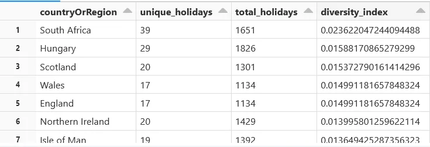
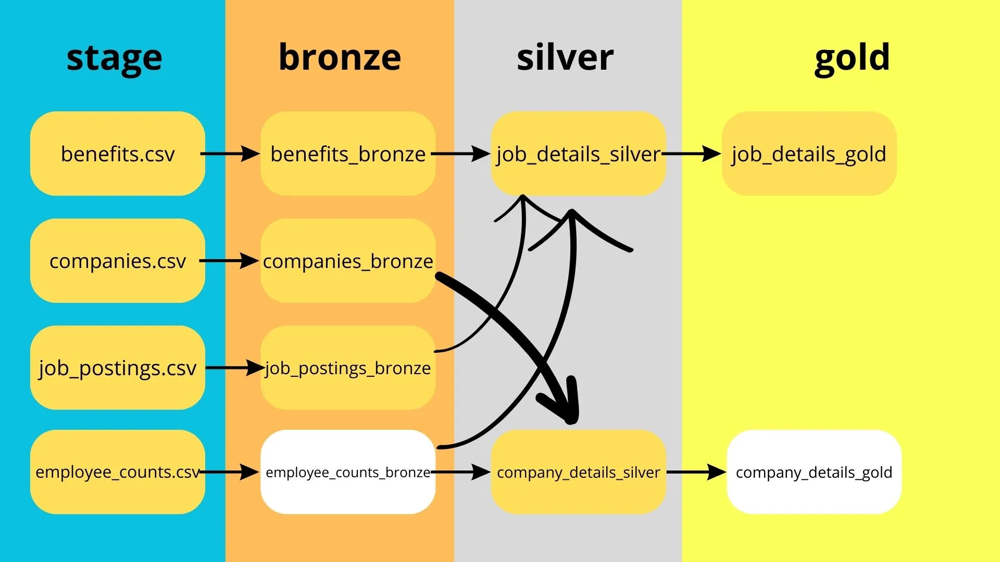
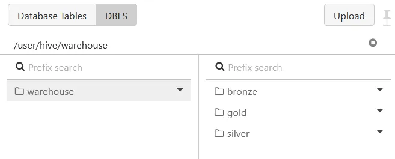
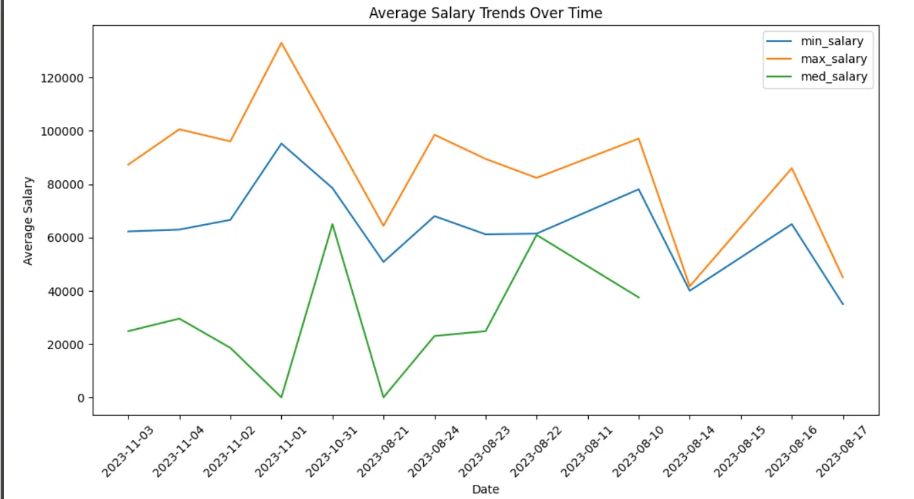

# Databricks
# This task consists of two blocks:

- Holidays Dataset
- LinkedIn dataset

The goal of the first block is to get familiar with the capabilities of Databricks, understand what is **dbfs, mounts, clusters,** how to configure and connect an external storage (aws s3, azure blob/data lake, gcp cloud storage, etc.) as well as completing some simple tranformations with pyspark.

The goal of the second block is to understand what is a **Delta Table, Delta Lake, Medallion Architecture** and create a simplified pipeline using the bronze/silver/gold layers.

## FYI:

1. [Most basic тутор от Индуса по DB communtiy edition](https://www.youtube.com/watch?v=uUZE8c8e0Jo&ab_channel=JustAPassionateCoder)

---

## Block 1 (Sub-tasks):

1. Create Databricks Community Edition [account](https://community.cloud.databricks.com/)
2. Turn on DBFS in Admin settings → workspace settings → dbfs file browser
3. Mount this azure [dataset](https://learn.microsoft.com/en-us/azure/open-datasets/dataset-public-holidays?tabs=azure-storage#data-access) to your databricks community edition workspace
4. Read the mounted parquet file and complete the following steps:
- Data Preparation:
    - Extract Year, Month, and Day from Date
    Transform the 'date' column to extract the year, month, and day components into separate columns.
    - Rename "countryOrRegion" column to "country”
    - Convert Timestamp to Date:
    Convert the 'date' column from timestamp format to a more readable date format.
- Transformations:
    - Calculate the Number of Unique Holidays per Year:
    Group the data by year and calculate the number of unique holidays in each year.
    *Result example*:
    
   

    
    - Day of the Week Analysis: 
    Analyze the distribution of holidays across different days of the week. 
    Create a bar chart or other visualizations to highlight patterns.
    *Result example*:
    
    

    
    

    
    - Time Since Last Holiday:
    Calculate the duration since the last holiday for each Country of data. This can be useful for understanding the gaps between holidays.
    *Result example*:
    
    

    
    - Holiday Diversity Index:
    Create an index that measures the diversity of holidays in each country or region based on the number of unique holidays and their frequency.
    Have a column with the number of unique holidays for each country, column with total number of holidays and a column with diversity index
    Find the country with the most number of unique holidays
    *Result example*:
    
    

    

---

## FYI Delta Tables:

1. [Delta tables](https://www.youtube.com/watch?v=PIJobfHvLzg&ab_channel=DataCafe)
2. [Medallion Architecture](https://habr.com/ru/companies/otus/articles/914864/?ysclid=mk5a79h16a151078681)
3. [Delta Lake](https://www.google.com/url?sa=t&rct=j&q=&esrc=s&source=video&cd=&cad=rja&uact=8&ved=2ahUKEwjWt66hkOyCAxVNFhAIHWUdAKgQtwJ6BAgGEAI&url=https%3A%2F%2Fwww.databricks.com%2Fresources%2Fdemos%2Fvideos%2Flakehouse-platform%2Fdelta-lake&usg=AOvVaw0eRzRVlRdO6paGb_2uYVO3&opi=89978449)

## Block 2 (Sub-tasks):

1. Use csv files from [here](./data)
2. You will make a pipeline which will consist of multiple databricks notebooks, its logic is going to look like this:




## Requirements:

- You will have a separate file for each neccessary table in bronze, silver and gold layers (example: benefits_bronze is one table, job_details_silver is a different one)
- You need to have you Delta Lake in Databricks dbfs (example path: dbfs:/user/hive/warehouse)




- Again, you’ll have one notebook per table, I’ll give an example:
lets say you have sample.csv file, and its bronze notebook will have sctructure similar to this:

```python
# read file
bronze_sample = spark.read.csv(”sample.csv”)

# transformations
bronze_sample = bronze_sample.na.drop()

#save your delta table
bronze_sample.write.format("delta").mode("overwrite").save("path/to/your/delta/lake/bronze")
```

## Actual tasks:

### Data exploration:

- Explore the max, min, count and stdev of **min_salary**, **max_salary**, **med_salary** columns of **job_postings.csv** df. (use describe() method)
- **Average salary trends over time** - find mean() for min_salary, max_salary and med_salary grouped by date (you need to create the date column for that) and plot it.
Result example:




- Find the percentage of missing data for **min_salary**, **max_salary**, **med_salary**

### Medallion architecture pipeline:


1. job_postings_bronze:
- Read job_postings.csv
- Fill empty values in columns **max_salary**, **med_salary** and **min_salary** with according mean values using **pyspark.ml.feature.Imputer**.
- Drop rows which have empty **job_id**.
- Convert **listed_time** to “yyyy-mm-dd” format.
- Save **job_postings_bronze** as delta format in your bronze dir.
1. job_details_silver:
- Left join bronze **job_postings_bronze** with **benefits_bronze** and **employee_counts_bronze**
- Save **job_details** as delta format in your silver dir.
1. company_details_silver:
- Left join **companies_bronze** with **employee_counts_bronze**
- Save **company_details** as delta format in your silver dir.
1. job_details_gold:
- Calculate average employee count using a window function
- Save **job_details_gold** as delta format in your gold dir.

These were the tables which had actual transformations in them, simply read and write the rest of the bronze/silver/gold tables as delta tables in their according notebooks.

---

## Интересные видосы по теме:

- [**Behind the Hype - The Medallion Architecture Doesn't Work**](https://www.youtube.com/watch?v=fz4tax6nKZM&ab_channel=AdvancingAnalytics)

## Вопросы по теории:

- **What is Databricks and how does it differ from regular Apache Spark?**
- **Explain the purpose of DBFS (Databricks File System).**
- **How do you mount external storage, such as Azure Blob Storage or AWS S3, in Databricks?**
- **What are the benefits of using Databricks clusters for big data processing?**
- **Explain what a Delta Table is in the context of Delta Lake.**
- **Describe the Medallion Architecture and how it relates to Delta Lake.**
